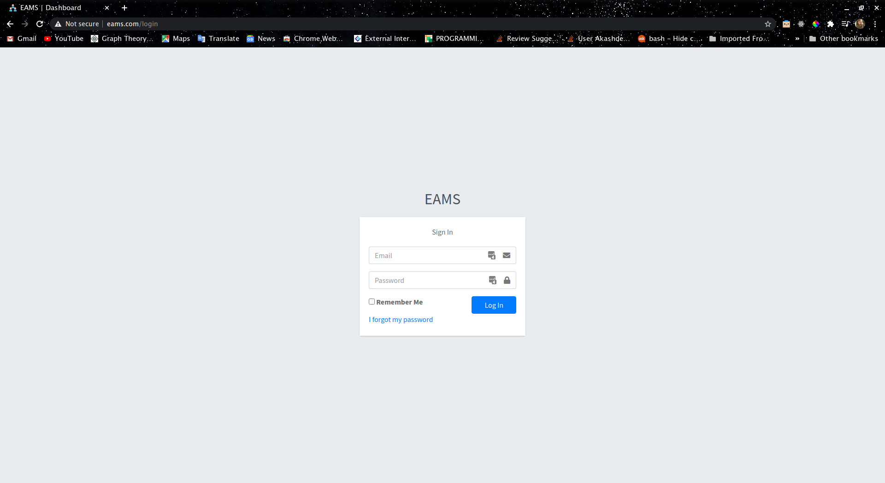
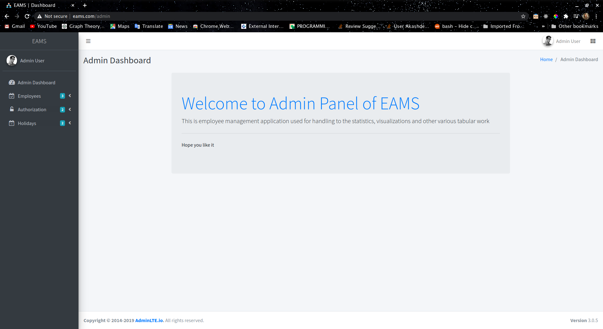
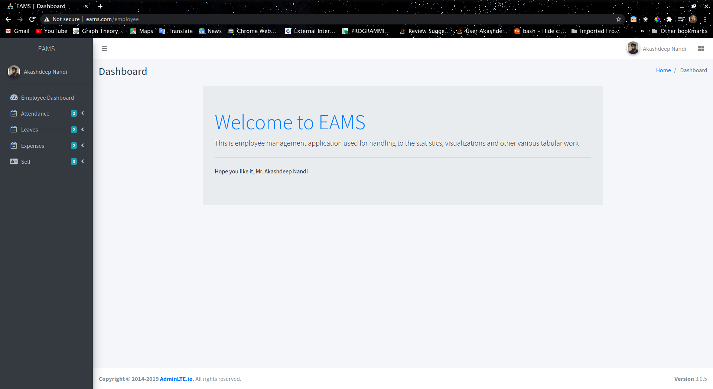
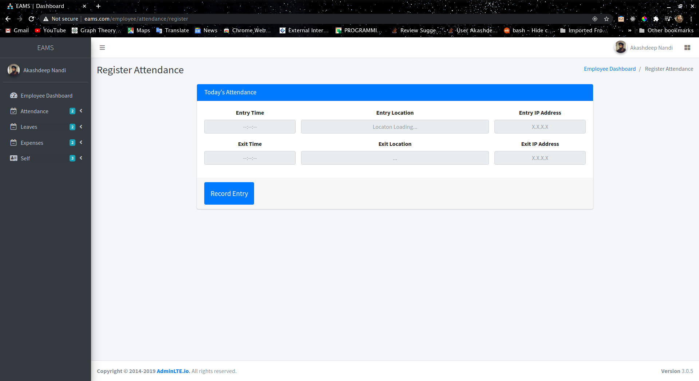
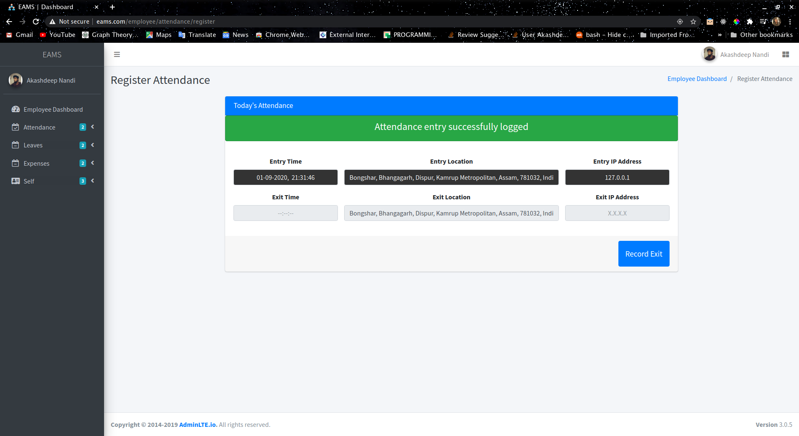
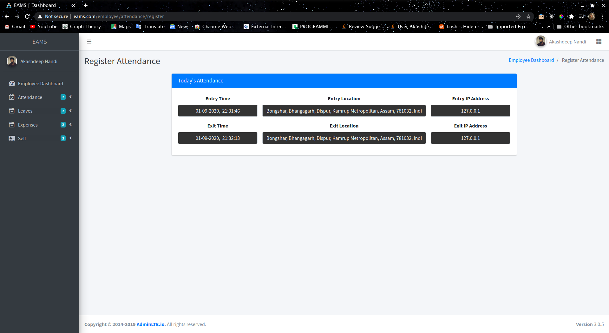
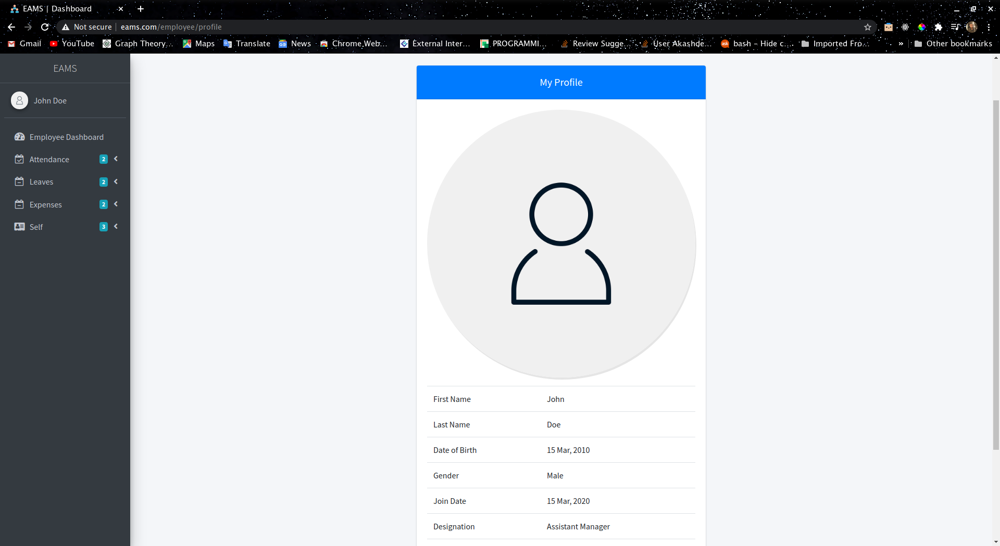
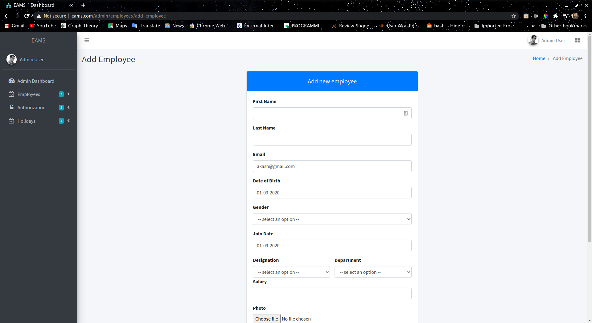
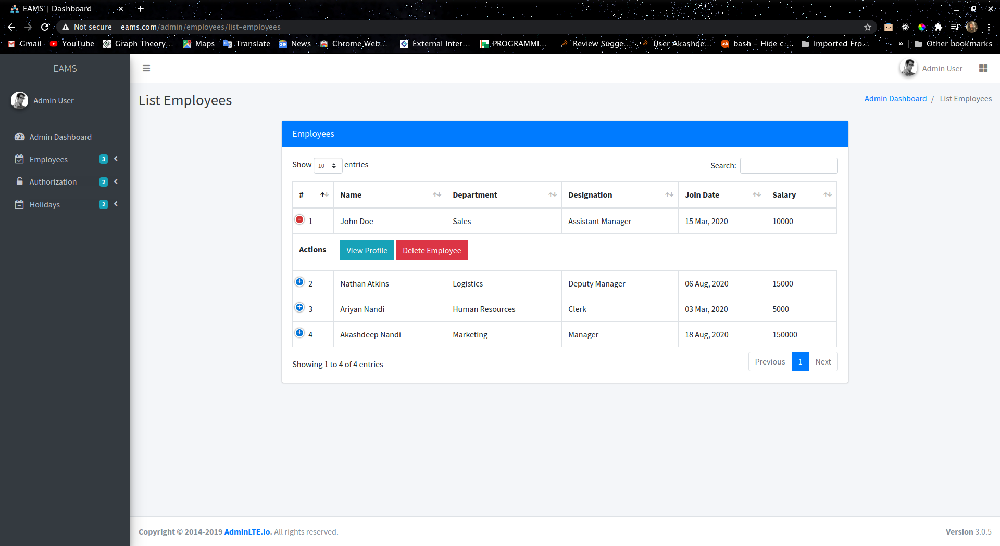
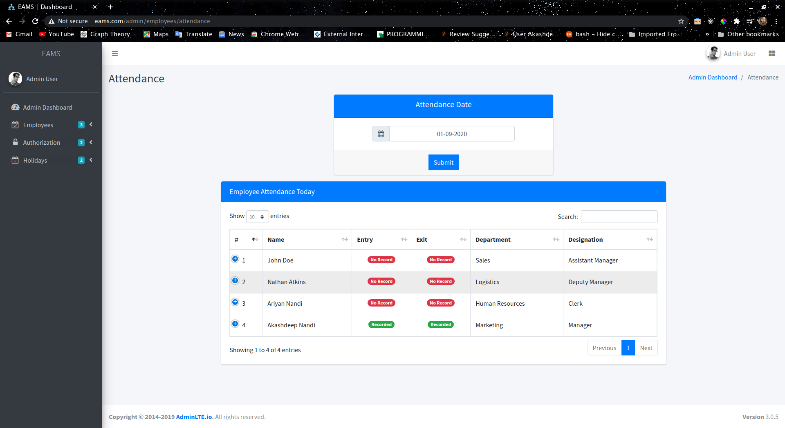

## About EAMS

EAMS is a web application used for HRM of employees with robust authentication and access manangement system made in lastest Laravel 7.25 Framework and MySQL.

- [Simple, fast routing engine of laravel is used](https://laravel.com/docs/routing).

- Expressive, intuitive [database ORM](https://laravel.com/docs/eloquent) is used for database queries.
- Efficient usage of laravel [relationships](https://laravel.com/docs/7.x/eloquent-relationships).

- [Gates](https://laravel.com/docs/7.x/authorization) used  for authorizations.
- [Session](https://laravel.com/docs/7.x/session) used for remembering the logged in user.
- Optimal usage of laravel [advanced routing](https://laravel.com/docs/4.2/routing)
- Fully responsive website across all devices and screen sizes.

EAMS is fast and easy to use and can be customized easily according to client project


<p align="center">Login Page</p>


<p align="center">Admin Dashboard</p>


<p align="center">Employee Dashboard</p>

## Usage

### Functions

It has two sides employee and admin side.
**Employee** has:
- Attendance module
	- Register attendance [The images have 127.0.0.1 as IP because it was being tested locally, on live server it will catch client IP using laravel method Request()->ip]
		- While recording user public IPv4 and current location in address format using reverse geocoding.
	- List attendances

	
	<p align="center">Register page</p>
	
	<p align="center">Registered entry</p>
	
	<p align="center">Registered exit</p>
- Leaves
	- Apply for leaves
	- Review leave status applied
- Expenses
	- Claim for an expense
	- Review expenses claimed
- Self
	- View Holiday List
	- Print salary slip
- Profile
	- Set profile information
	- Change password
	
	<p align="center">Employee profile</p>
**Admin** has:
- Employee module
	- Add employee
	
	<p align="center">Employee profile</p>

	- View employees
	
	<p align="center">Employee profile</p>

	- Monitor employee attendance
	
	<p align="center">Employee profile</p>
- Authorizate
	- Leaves applied
	- Expenses claimed
- Holidays
	- Add, edit, remove holidays according to company regulations

### Configuration

Make sure that this project has proper file permissions.
To run this project, you will need to set up a database and a smtp server for password reset and add it to your .env file

After that, you run migration to get it running.

```console
php artisan migrate
```

And link public folder to storage for file uploads

```console
php artisan storage:link
```

To get initial test data in database

```console
php artisan db:seed
```

## Themes, plugins, packages used for developement
Following are the assets used for this project
-	[AdminLTE](https://adminlte.io/) a bootstrap and jquery based admin dashboard theme
-	[DataRangePicker](https://www.daterangepicker.com/) for date pickers
-	[DataTables](https://datatables.net/) for responsive table
-	[Intervention/Image](http://image.intervention.io/getting_started/installation) package in laravel for image upload optimisaton
-	[HTML Geolocation API](https://www.w3schools.com/html/html5_geolocation.asp) which works only on SSL, for using make sure your domain is SSL certified.
-	[Nominatim](https://nominatim.org/) an open source geocoding API for reverse geocoding.
